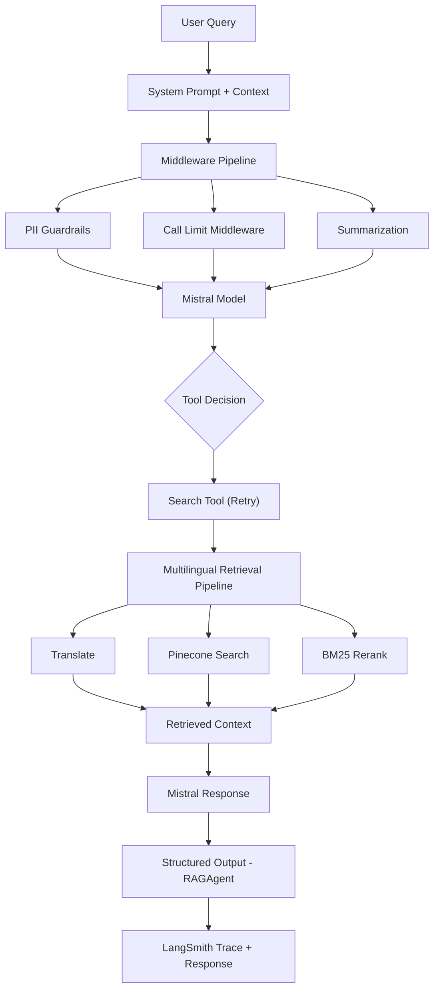

# 🌍 Multilingual RAG System (English, Hindi, Bengali)

## 1. Objective

A powerful **Retrieval-Augmented Generation (RAG)** system designed for **multilingual document search and question answering** across **English, Hindi (हिन्दी), and Bengali (বাংলা)**.

This system enables **cross-lingual retrieval**, meaning users can query in one language and retrieve relevant information from documents in another — all while receiving responses in their original query language.

---

## 2. Architecture

### 2.1 Agent (Core Orchestrator)

The agent serves as the central intelligence layer, coordinating all components of the RAG pipeline:

#### Agent Configuration

- **Model:** `ministral-8b-latest`
- **Temperature:** `0.7`
- **Timeout:** `60 seconds`
- **Model Retry:** Up to 3 retries with exponential backoff for transient failures.
- **Tools:** `search` (Retrieves relevant document chunks from the multilingual retrieval pipeline.)
- **Tool Retry:** Automatically retries failed retrievals caused by temporary connection or timeout errors.
- **Model Call Limits:** Maximum 3 model calls per run and 20 per conversation thread.
- **Tool Call Limits:** Maximum 2 search tool calls per run and 20 per conversation thread.
- **Middleware:**
  - `PIIMiddleware` – Redacts email addresses, masks credit card numbers, and blocks API keys.
  - `SummarizationMiddleware` – Automatically summarizes long conversations after 4000 tokens to manage context length.
- **Response Format:** `RAGAgent` (Structured JSON response containing the generated answer.)
- **System Prompt:** Guides the agent to answer only from retrieved document context, provide citation-backed responses, and reply in the user's original language.
- **Language Handling:** Supports English, Hindi, and Bengali by retrieving multilingual context while responding in the user's original language.
- **Context Schema:** `UserContext` (Securely passes namespace and document IDs to tools without exposing them to the LLM.)
- **Error Handling:** Distinguishes between retryable and non-retryable tool failures with graceful recovery for transient failures.

---

### 2.2 Document Processing Pipeline

#### 📥 Text Extraction

- PDFs → `pdfplumber`
- DOCX/DOC → `python-docx` (+ LibreOffice for `.doc`)

#### 🧹 Text Cleaning

- Unicode normalization
- Special character removal
- Whitespace cleanup

#### ✂️ Chunking

- Sentence-based chunking
- Default chunk size: **150 words**
- Default overlap: **25 words**

---

### 2.3 Embedding Layer

- **Model:** `gemini-embedding-001`

---

### 2.4 Vector Database

- **Platform:** Pinecone (serverless)
- **Similarity Metric:** Cosine similarity
- **Metadata Stored:**
  - Chunk text
  - Language
  - Tokens
  - Document ID
- **Filtering Support:**
  - Document-level filtering during retrieval

---

### 2.5 Search & Retrieval Pipeline

#### 🔎 Step 1: Semantic Search

- Vector similarity using embeddings

#### 🔁 Step 2: BM25 Reranking

- Language-aware tokenization
- IDF-based term weighting
- Score normalization (min-max scaling)

#### 🔀 Hybrid Retrieval

- Combines semantic understanding with keyword precision

---

### 2.6 Language Handling

- 🏷️ Language detection using `langdetect`
- 🔤 Language-specific token filtering
- 🌍 Cross-lingual query support
- 🔁 Query translation (Hindi ↔ Bengali ↔ English)

---

### 2.7 LLM Integration

- **Model:** Mistral AI (`ministral-8b-latest`)

---

### 2.8 Caching Layer (Redis)

#### Architecture

- Primary Storage: Redis for fast read/write operations
- Persistence: PostgreSQL for permanent storage (async background writes)
- TTL: 2 hours for conversation cache
- Auto-cleanup: Expired conversations removed after 1 hour

#### Key Features

- Write-through caching: All writes go to Redis first, then asynchronously to PostgreSQL
- Batch database writes: Configurable batch size (default: 50) for optimal performance
- Message tracking: Tracks which messages are saved to database to prevent duplicates
- Background workers: Async workers handle database persistence without blocking main flow

---

### 2.9 Response Formatting

- **RAGAgent:** Custom response model for structured output

---

## 3. Evaluation Results

- **Precision:** 0.7313
- **Recall:** 0.8604
- **Faithfulness:** 0.8331

---

## 4. Tech Stack

| Component           | Technology                    |
| ------------------- | ----------------------------- |
| **Agent/LLM**       | Mistral AI (`ministral-8b`)   |
| **Embeddings**      | Google Gemini Embedding       |
| **Vector Database** | Pinecone (Serverless)         |
| **Cache**           | Redis                         |
| **Database**        | PostgreSQL                    |
| **Backend**         | FastAPI + Uvicorn             |
| **Monitoring**      | LangSmith                     |
| **Auth**            | Google OAuth + JWT            |
| **PDF Processing**  | pdfplumber                    |
| **DOCX Processing** | python-docx + LibreOffice     |

---

## 5. Setup Instructions

### 5.1 Prerequisites

- Python 3.9+
- Redis Server
- PostgreSQL (optional, for persistence)
- LibreOffice (for `.doc` file conversion)

---

### 5.2 Installation

git clone <<https://github.com/acrobyte007/Multilingual_Agentic_RAG>>
cd multilingual-rag
pip install -r requirements.txt

---

### 5.3 Environment Variables

Create a `.env` file with the following:

PINECONE_API_KEY=your_pinecone_key
GOOGLE_API_KEY=your_google_key
MISTRAL_API_KEY=your_mistral_key
REDIS_PASSWORD=your_redis_password
REDIS_PORT=6379
REDIS_HOST=localhost
SECRET_KEY=your_jwt_secret
ALGORITHM=HS256
ACCESS_TOKEN_EXPIRE_MINUTES=60
GOOGLE_CLIENT_ID=your_google_client_id
LANGSMITH_TRACING=true
LANGSMITH_API_KEY=your_langsmith_key
LANGSMITH_PROJECT=multilingual-rag
LANGSMITH_ENDPOINT=<<https://api.smith.langchain.com>>

---

### 5.4 Run the System

uvicorn main:app --reload --port 8000

---

## 6. Example Workflow

1. Upload documents (PDF/DOCX/DOC)
2. System processes and chunks text
3. Embeddings are generated and stored in Pinecone
4. User submits a query (any supported language)
5. System:
   - Detects language
   - Retrieves relevant chunks
   - Applies BM25 reranking
6. LLM generates a response with citations

---

## 7. Example Queries

- **English:** *"What are the key points in this report?"*
- **Hindi:** *"इस दस्तावेज़ का सारांश क्या है?"*
- **Bengali:** *"এই নথির মূল বিষয় কী?"*

---

## 8. Future Improvements

- 🔊 Voice-based multilingual queries
- 📱 Web UI / dashboard
- 📚 Support for more languages (Tamil, Telugu, etc.)
- 🧠 Advanced reranking models (cross-encoders)
- 📊 Real-time evaluation dashboard
- 🔐 Role-based access control (RBAC)
  